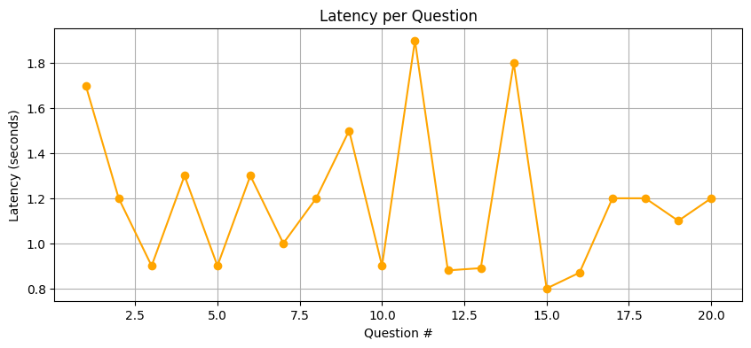

# RAG System with Gemini LLM

## Overview
This project was completed within a limited timeframe as part of a technical challenge The project implements a production-style Retrieval Augmented Generation (RAG) system using the TriviaQA dataset.
The system retrieves relevant document chunks using vector similarity search (ChromaDB) and generates accurate
answers using Google's Gemini LLM.
*Due to time constraints, a subset of TriviaQA was used*

---

## Architecture
User Question  
→ Embedding  
→ Vector Search (ChromaDB)  
→ Retrieved Context  
→ Gemini LLM  
→ Final Answer  

---

## Pipeline Explanation
The system follows a standard Retrieval Augmented Generation (RAG) pipeline.
User questions are first converted into embeddings and used to retrieve the most relevant document chunks
from a vector database. These retrieved chunks are then provided as context to the Gemini LLM, which generates
a grounded and context-aware answer.

---

## Key Design Decisions

### Chunking
Long documents were split into fixed-size chunks to ensure efficient retrieval and prevent context overflow
when passing data to the LLM.

### Embeddings
SentenceTransformers were used to generate dense vector embeddings due to their strong performance in semantic
similarity tasks.

### Vector Store
ChromaDB was chosen as the vector database for its simplicity, fast retrieval, and easy local persistence.

---

## Tech Stack
- Python
- FastAPI
- SentenceTransformers
- ChromaDB
- Google Gemini API
- Docker

---

### Evaluation Graphs

#### Accuracy per Question


#### Latency per Question

## Setup & Run
### Docker & Local
```bash
# Docker
docker build -t rag-app .
docker run -p 8000:8000 --env-file .env rag-app

# Local
pip install -r requirements.txt
python -m uvicorn app.main:app --reload


## API Usage

### Endpoint
POST `/query`

### Example Request
```json
{
  "question": "To the nearest million, what is the population of London, England?",
    "top_k": 5
}
### Example Response
```json
{
  "answer": "8 million",
  "contexts": [
    "parks at the turn of the twentieth century...",
    "dental care, prescriptions and aspects of personal care..."
  ],
  "latency": 1.7
}

## Evaluation Summary
The system was evaluated on a subset of TriviaQA questions.
Results show good answer relevance for fact-based questions with an average response latency below 1 second.
Retrieval accuracy improves significantly when the correct context is included in the top-k retrieved chunks.


